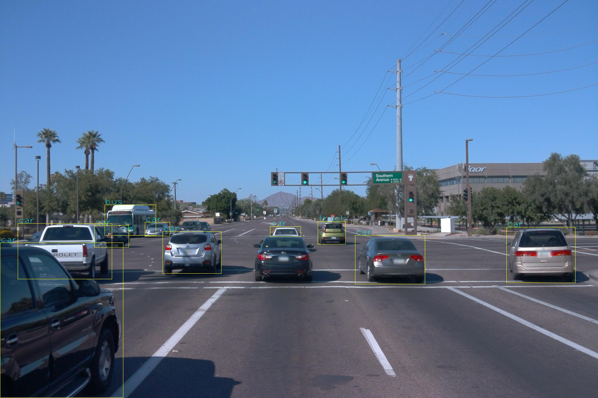

## 简介
yolov3.cpp为yolov3网络的预处理与后处理操作 (yolo+nms)

## run
```shell
./make.sh
./yolov3
```


## 其他
 - 代码编译依赖opencv，记得提前安装
 - 代码中 TODO:: npu_run 为你的forword代码
 - make.sh内部默认是yolov3_int8.cpp，因为我是在npu做的demo，需要对输入进行量化，输出进行反量化，所以当你使用的时候需要稍微修改这部分的代码
 - yolov3_float.cpp是没有经过测试的float输入输出的代码
 - 文件的开头有yolo的一些配置，记得改成你自己的
 - yolo操作中 框的计算需要根据你自己的代码进行修改(demo是以pytorch yolov3为例)
 - 文件还有很多可以优化的地方，有时间再做吧！！！
